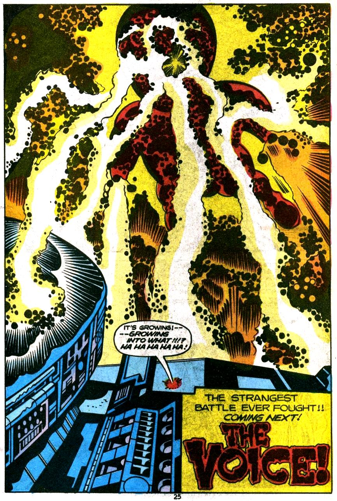
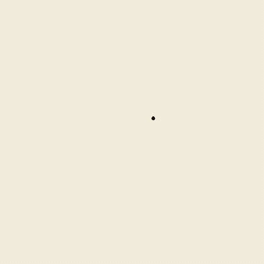

# The Kirby Krackle

Based on the unique styling of Jack "The King" Kirby. Read more about how the power cosmic pops from the page [here](https://en.wikipedia.org/wiki/Kirby_Krackle).

<table>
<tr>
<td></td>
<td></td>
</tr>
<tr>
<td align="center"><sub>The King's original</sub></td>
<td align="center"><sub>This library, in a browser</sub></td>
</tr>
</table>

**[Live demo](https://chrisbodhi.github.io/krackle/krackle-demo.html)** — click anywhere.

## Usage

`initKrackle()` appends one full-viewport `<canvas>` to `<body>` and
wires up a `click` listener (each click bursts), plus `resize`,
`visibilitychange`, and theme-change listeners to keep it in sync with
the page. Particles are drawn from a fixed-size pool via a single
`requestAnimationFrame` loop that runs only while particles are alive
and goes idle otherwise. `destroy()` (returned from `initKrackle()`)
removes the canvas and unregisters all of those listeners, fully
reverting the page to its pre-Krackle state.

### Simple

Import it straight from jsDelivr's GitHub CDN — no install, no build step:

```html
<script type="module">
  import { initKrackle } from "https://cdn.jsdelivr.net/gh/chrisbodhi/krackle@v0.3.0/krackle.esm.min.js";
  const krackle = initKrackle();
  // later, to tear down the canvas and listeners:
  // krackle.destroy();
</script>
```

Pin to a tag (`@v0.3.0`) like above for stability, or drop the version
(`.../gh/chrisbodhi/krackle/krackle.esm.min.js`) to always get the latest
tagged release — not recommended for production, since a new tag changes
the file out from under you without warning.

To self-host instead, copy `krackle.esm.min.js` into your project and
import it from there:

```html
<script type="module">
  import { initKrackle } from "./krackle.esm.min.js";
  const krackle = initKrackle();
</script>
```

Every click detonates a burst at the click point — dot masses bloom
outward, and by default the whole page's colors invert for an instant,
like the discharge blew out the screen. No setup required — it appends a
full-viewport `<canvas>`, reads `--krackle-fill` for ink color (default
`#16130f`), and cleans up after itself via `destroy()`.

### With dark mode themes

Krackle checks a `--krackle-mode` CSS custom property (`"light"` or
`"dark"`) to pick its sprite set, falling back to sampling the page
background color if the property is absent. Set it — and the matching
`--krackle-fill` / `--krackle-rim` tokens — per theme:

```css
:root, [data-theme="light"] {
  --krackle-fill: #16130f;  /* ink color */
  --krackle-rim: #f2ecdc;   /* halo around ink in dark mode */
  --krackle-mode: light;
}
[data-theme="dark"] {
  --krackle-fill: #0a0908;
  --krackle-rim: #e8e0cc;
  --krackle-mode: dark;
}
```

Krackle watches for attribute changes on `<html>`/`<body>` (class,
`data-theme`, `style`) and OS-level `prefers-color-scheme` changes, and
rebuilds its sprite atlas automatically — no need to call `initKrackle()`
again when the theme flips.

## Options

`initKrackle(options)` takes a partial `KrackleOptions` object — anything
you omit falls back to the tuned defaults below.

| Option | Default | What it does |
| --- | --- | --- |
| `maxParticles` | `920` | Particle pool size — caps how many dots can be alive across overlapping bursts. |
| `lifespan` | `[1200, 2500]` | How long a burst lives before it's fully faded, ms. |
| `zIndex` | `10` | Canvas z-index. |
| `seed` | `19620828` | Sprite atlas seed (Kirby's birthday). |
| `fillVar`, `rimVar`, `modeVar` | `--krackle-fill`, `--krackle-rim`, `--krackle-mode` | CSS custom properties read for ink color, dark-mode rim color, and forced light/dark mode. |
| `lobesMax` | `5` | Max silhouette lobes bulging off each dot's mask — more is spikier and lumpier. |
| `lobeSpread` | `0.55` | How far lobes bulge out from a dot's core silhouette. |
| `rimWidth` | `1.5` | Width (px) of the light halo drawn under the ink in dark mode. |
| `satsMax` | `2` | Max satellite dots per cluster. |
| `satSpread` | `1.55` | How far satellites scatter from their anchor, ×anchor radius. |
| `rays` | `[2, 4]` | Number of preserved white channels radiating from the click, min–max. |
| `rayHalf` | `[0.32, 0.44]` | Half-angle width of each preserved white ray, radians. |
| `burstRadius` | `[22, 210]` | How far from the click clusters first spawn — inner/outer band radius, px. |
| `anchorRadius` | `[6, 14.5]` | Radius range for the big central dot of each cluster, px. |
| `satRadius` | `[4.5, 10]` | Radius range for the smaller dots scattered around each anchor, px. |
| `dissolve` | `0.15` | How much satellites shrink the farther they land from their anchor. |
| `driftRange` | `[34, 106]` | Extra outward drift each cluster travels after spawning, px. |
| `bandAttempts` | `[14, 18, 26]` | Clusters attempted per radial band, inner→outer — the density knob. |
| `bandDelayMs` | `85` | Delay between each outward band's bloom, ms. |
| `flash` | `"invert"` | Full-viewport flash on click: `"none"`, `"white"` (wash toward white), or `"invert"` (color-inverts the whole page, ink blobs included, for an instant). |
| `flashMs` | `180` | How long the flash takes to fade out, ms. |
| `flashPeak` | `0.85` | The flash's opacity at the instant of the click. |

`krackle-demo.html` has a live tuning panel for all of the above — click
**⚙ Tune** to open it. Every field has a slider (or dropdown, for
`flash`), an **ⓘ** button with a short explanation, and a **↺** button
to reset just that one field; **↺ Reset all** resets everything at once.
**⧉ Copy config** copies the current values as JSON, handy for pasting a
tuned result back into `DEFAULTS` in `krackle.ts`.

## Development

Development depends on [Bun](https://bun.com). Install it, and then proceed.

To install dependencies:

```bash
bun install
```

To run the demo using Bun's first-class HTML support:

```bash
bun krackle-demo.html
```

To build a new minified version for the browser, run

```bash
bun run build
```

### Keep the demo GIF in sync

The animated GIF at the top of this README (`assets/krackle.gif`) is a
recording of the real burst. If your change alters the visible behavior —
retuned burst defaults, the flash/invert, colors, timing — please
regenerate it so the README reflects what ships, and update the image's
`alt` text if the effect changed. The capture-and-encode workflow (browser
capture → `ffmpeg`) is documented for Claude Code in
`.claude/skills/readme-gif/`; run `bun run build` first so the GIF captures
the built module.
