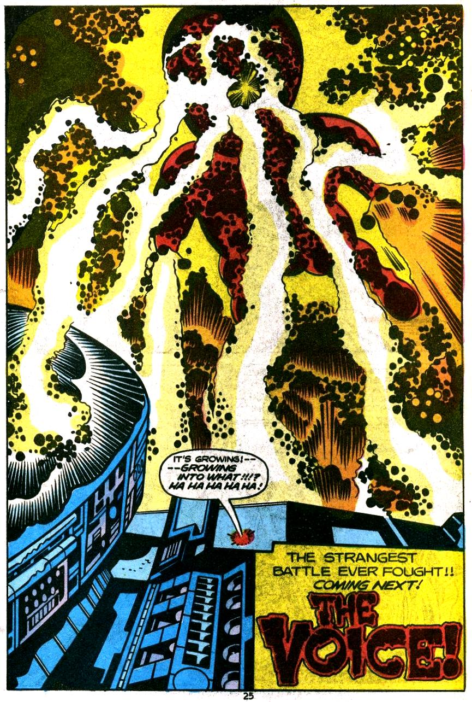
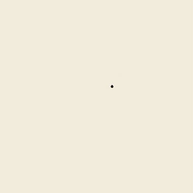

# The Kirby Krackle

Based on the unique styling of Jack "The King" Kirby. Read more about how the power cosmic pops from the page [here](https://en.wikipedia.org/wiki/Kirby_Krackle).

<table>
<tr>
<td></td>
<td></td>
</tr>
<tr>
<td align="center"><sub>The King's original</sub></td>
<td align="center"><sub>This library, in a browser</sub></td>
</tr>
</table>

**[Live demo](https://chrisbodhi.github.io/krackle/krackle-demo.html)** — click anywhere.

## Usage

`initKrackle()` appends one full-viewport `<canvas>` to `<body>` and
wires up a `click` listener (each click bursts), plus `resize`,
`visibilitychange`, and theme-change listeners to keep it in sync with
the page. Particles are drawn from a fixed-size pool via a single
`requestAnimationFrame` loop that runs only while particles are alive
and goes idle otherwise. `destroy()` (returned from `initKrackle()`)
removes the canvas and unregisters all of those listeners, fully
reverting the page to its pre-Krackle state.

### Simple

Import it straight from jsDelivr's GitHub CDN — no install, no build step:

```html
<script type="module">
  import { initKrackle } from "https://cdn.jsdelivr.net/gh/chrisbodhi/krackle@v0.3.0/krackle.esm.min.js";
  const krackle = initKrackle();
  // later, to tear down the canvas and listeners:
  // krackle.destroy();
</script>
```

Pin to a tag (`@v0.3.0`) like above for stability, or drop the version
(`.../gh/chrisbodhi/krackle/krackle.esm.min.js`) to always get the latest
tagged release — not recommended for production, since a new tag changes
the file out from under you without warning.

To self-host instead, copy `krackle.esm.min.js` into your project and
import it from there:

```html
<script type="module">
  import { initKrackle } from "./krackle.esm.min.js";
  const krackle = initKrackle();
</script>
```

Every click detonates a burst at the click point — dot masses bloom
outward, and by default the whole page's colors invert for an instant,
like the discharge blew out the screen. No setup required — it appends a
full-viewport `<canvas>`, reads `--krackle-fill` for ink color (default
`#16130f`), and cleans up after itself via `destroy()`.

### With dark mode themes

Krackle checks a `--krackle-mode` CSS custom property (`"light"` or
`"dark"`) to pick its sprite set, falling back to sampling the page
background color if the property is absent. Set it — and the matching
`--krackle-fill` / `--krackle-rim` tokens — per theme:

```css
:root, [data-theme="light"] {
  --krackle-fill: #16130f;  /* ink color */
  --krackle-rim: #f2ecdc;   /* halo around ink in dark mode */
  --krackle-mode: light;
}
[data-theme="dark"] {
  --krackle-fill: #0a0908;
  --krackle-rim: #e8e0cc;
  --krackle-mode: dark;
}
```

Krackle watches for attribute changes on `<html>`/`<body>` (class,
`data-theme`, `style`) and OS-level `prefers-color-scheme` changes, and
rebuilds its sprite atlas automatically — no need to call `initKrackle()`
again when the theme flips.

## Options

`initKrackle(options)` takes a partial `KrackleOptions` object — anything
you omit falls back to the tuned defaults below.

| Option | Default | What it does |
| --- | --- | --- |
| `maxParticles` | `920` | Particle pool size — caps how many dots can be alive across overlapping bursts. |
| `lifespan` | `[1200, 2500]` | How long a burst lives before it's fully faded, ms. |
| `zIndex` | `10` | Canvas z-index. |
| `seed` | `19620828` | Sprite atlas seed (Kirby's birthday). |
| `fillVar`, `rimVar`, `modeVar` | `--krackle-fill`, `--krackle-rim`, `--krackle-mode` | CSS custom properties read for ink color, dark-mode rim color, and forced light/dark mode. |
| `lobesMax` | `5` | Max silhouette lobes bulging off each dot's mask — more is spikier and lumpier. |
| `lobeSpread` | `0.55` | How far lobes bulge out from a dot's core silhouette. |
| `rimWidth` | `1.5` | Width (px) of the light halo drawn under the ink in dark mode. |
| `satsMax` | `2` | Satellite dots per cluster — but see the note below: at the default it has no effect. |
| `satSpread` | `1.55` | How far satellites scatter from their anchor, ×anchor radius. |
| `rays` | `[2, 4]` | Number of preserved white channels radiating from the click, min–max. |
| `rayHalf` | `[0.32, 0.44]` | Half-angle width of each preserved white ray, radians. |
| `burstRadius` | `[22, 210]` | How far from the click clusters first spawn — inner/outer band radius, px. |
| `anchorRadius` | `[6, 14.5]` | Radius range for the big central dot of each cluster, px. |
| `satRadius` | `[4.5, 10]` | Radius range for the smaller dots scattered around each anchor, px. |
| `dissolve` | `0.15` | How much satellites shrink the farther they land from their anchor. |
| `driftRange` | `[34, 106]` | Extra outward drift each cluster travels after spawning, px. |
| `bandAttempts` | `[14, 18, 26]` | Clusters attempted per radial band, inner→outer — the density knob. |
| `bandDelayMs` | `85` | Delay between each outward band's bloom, ms. |
| `flash` | `"invert"` | Full-viewport flash on click: `"none"`, `"white"` (wash toward white), or `"invert"` (color-inverts the whole page, ink blobs included, for an instant). |
| `flashMs` | `180` | How long the flash takes to fade out, ms. |
| `flashPeak` | `0.85` | The flash's opacity at the instant of the click. |

> **Note on `satsMax`.** The name overstates what this knob does. Full and
> medium-mass clusters compute their satellite count as
> `3 + ((srand() * (satsMax - 2)) | 0)`, so the option is really *three, plus
> up to `satsMax - 2` extra* rather than a cap. At the default of `2` that
> second term is always `0`, so every full or medium cluster gets exactly
> **three** satellites, not two, and the knob is inert. Measured behavior:
>
> | `satsMax` | Satellites per full/medium cluster |
> | --- | --- |
> | `0` | 2–3 |
> | `1`, `2` (default), `3` | exactly 3 |
> | `n` ≥ 4 | 3–`n` (so `5` → 3–5) |
>
> The `0` row is the truncation quirk, not a design: the product goes
> negative and `| 0` rounds it toward zero to `-1` exactly half the time.
> Dissolving tip clusters (the outermost band) ignore the option entirely
> and always take 2–3. The demo's tuning panel exposes the full 0–24 range,
> so all of the above is reachable there.
>
> This is documented rather than corrected because changing either the
> formula or the default would shift the burst's look. The particle counts
> in [How it stays fast](#how-it-stays-fast) reflect the real behavior.

`krackle-demo.html` has a live tuning panel for all of the above — click
**⚙ Tune** to open it. Every field has a slider (or dropdown, for
`flash`), an **ⓘ** button with a short explanation, and a **↺** button
to reset just that one field; **↺ Reset all** resets everything at once.
**⧉ Copy config** copies the current values as JSON, handy for pasting a
tuned result back into `DEFAULTS` in `krackle.ts`.

## How it stays fast

Krackle is a decorative overlay that sits on top of somebody else's page,
so it has two hard constraints: it must cost approximately nothing when
nobody is clicking, and it must never be the reason a frame is dropped
when somebody is. Every design decision below follows from those two.

At the shipped defaults, one click attempts 58 clusters
(`bandAttempts` = `[14, 18, 26]`), of which roughly 64% survive the
white-ray rejection, for about **37 clusters / 140 particles per burst**
(range 53–211, depending on how many rays the burst rolls and how wide
they are). The 920-slot pool therefore absorbs about **six and a half
overlapping bursts** before it starts recycling, against a particle
lifespan of 1.2–2.5s. You have to click roughly seven times in two
seconds to reach the ceiling.

### Nothing is drawn from paths at runtime

The expensive part of a Kirby dot is its silhouette. `makeMask()` builds
one by filling a base circle plus 1–5 randomly placed lobe circles; in
dark mode `finalize()` then stamps the tinted mask eight times around a
`rimWidth` circle to dilate a halo, and composites the ink body over it.
That is up to six `arc`/`fill` pairs and a dozen `drawImage` calls **per
dot**. Doing that for 900 dots at 60fps is not a thing that happens.

So it happens exactly once. `buildAtlas()` rasterizes 12 anchor sprites
and 6 satellite sprites — each in a light and a dark variant, 36 bitmaps
total — into offscreen canvases up front. The render loop's entire
per-particle drawing cost is one `ctx.drawImage()` of an existing
bitmap. The intermediate mask, halo, and tint canvases are dropped on
the floor after `buildAtlas()` returns; only the 36 finished sprites are
retained.

Variety comes from the pool of 18 shapes being sampled by size rather
than from generating new geometry: `anchorsBySize` and `satsBySize` hold
sprite indices sorted ascending by radius, so a cluster picks a shape by
rank (`rank * ANCHOR_COUNT | 0`) and outer, dissolving bands index into
the small end without any new rasterization.

The atlas is rasterized at device resolution, so the steady-state draw
has no scale-up to resample — sprites only get resampled during the
110ms `easeOutBack` pop-in, where `scale` is briefly off 1.

### The device-pixel budget is clamped

`dpr = Math.min(devicePixelRatio || 1, 2)`. This is the single biggest
lever in the library, because it is quadratic on both axes at once:

| `dpr` | Retained atlas (36 bitmaps) | Canvas backing store, 1440×900 viewport |
| --- | --- | --- |
| 1 | ~287 KiB | ~4.9 MiB |
| 2 | ~1.1 MiB | ~19.8 MiB |
| 3 (unclamped) | ~2.5 MiB | ~44.5 MiB |

On a 3× phone display, clamping to 2 cuts both the atlas and the
per-frame fill rate by 55% for a set of soft-edged, semi-transparent ink
blobs where the difference is not visible. The clamp is applied in
`sizeCanvas()` and threaded through `makeMask()`/`finalize()`, so the
atlas and the canvas always agree.

### The pool never allocates

`pool` is built once at init as `maxParticles` object literals that all
share a single field order — same hidden class, so the engine keeps the
whole array monomorphic. `alloc()` does not create anything:

```ts
function alloc(): Particle {
  const p = pool[head]!;
  head = (head + 1) % pool.length;
  if (!p.alive) aliveCount++;
  p.alive = true;
  return p;
}
```

It is a ring buffer. A burst mutates existing objects in place and
allocates zero bytes, so no burst — however rapid — can schedule a GC
pause in the middle of its own animation. Overflow degrades gracefully:
past the pool ceiling `head` wraps and overwrites the oldest particles,
which are the ones already deepest into their fade. The cost of a burst
is bounded above no matter how hard the user mashes the mouse.

The `if (!p.alive)` guard is what keeps `aliveCount` honest when the ring
recycles a slot that was still live — the count is incremented on
first-claim only, and decremented once in `frame()` when the particle
expires.

### The loop halts, and knows when it can

There is no idle timer and no permanently-scheduled `requestAnimationFrame`.
`frame()` counts live particles as it draws; when that count hits zero it
clears the canvas one last time, sets `running = false`, and simply does
not reschedule:

```ts
if (live > 0) {
  raf = requestAnimationFrame(frame);
} else {
  running = false;
  ctx.clearRect(0, 0, canvas.width, canvas.height);
}
```

`wake()` restarts it, guarded on `running` so the ~37 `spawnCluster()`
calls in a single burst cost 36 boolean tests and one `requestAnimationFrame`.
`wakeIfAlive()` gates the resize and unhide paths on `aliveCount > 0`, so
resizing a window or tabbing back to an idle page does not spin the loop
up to render nothing. Between bursts, Krackle's main-thread cost is
exactly zero.

Particles staggered into the future (`age < 0`, the band-by-band bloom)
count as live and skip drawing, which is what keeps the loop alive across
the `bandDelayMs` gaps between bands.

### Hidden tabs don't burn animation, or lose it

`onVisibility()` cancels the pending frame outright when the tab hides —
browsers throttle background `rAF` anyway, but cancelling makes it
immediate and unconditional. The part that matters more is what happens
on the way back:

```ts
const pause = performance.now() - hiddenAt;
for (const p of pool) if (p.alive) p.birth += pause;
```

Particle age is derived from wall-clock deltas against `birth`, so
without this shift a burst would silently age out while off-screen and
you would return to a blank canvas — or worse, to a single catch-up
frame that jumps everything to its death. Shifting `birth` forward by
the hidden duration makes the burst resume exactly where it stopped.

### Redundant atlas rebuilds are cached away

A `MutationObserver` watching `class`, `data-theme`, and `style` on
`<html>` and `<body>` is a firehose — any inline style write on either
element triggers it. Rebuilding the atlas is 18 masks and ~90 canvas
allocations, so it must not run per signal. `refreshTheme()` composes a
cache key from the values that actually change the pixels:

```ts
const key = fill + "|" + rim + "|" + isDark;
if (!force && key === themeKey) return;
```

Anything that doesn't move that key is an early return. This is also
what makes the settle re-checks affordable: because a CSS-transitioned
background reports its *old* computed color at t≈0, every theme signal
schedules re-checks at 120ms, 450ms, and 1100ms (`SETTLE_MS`) to catch
the transition landing. Three extra checks per signal is fine when a
no-op check is a string compare.

Resize is debounced at 150ms (`onResize`), and the atlas is only rebuilt
from it when `dpr` actually changed — dragging a window edge changes the
viewport, but sprite pixel dimensions depend on device pixel ratio, not
on viewport size, so the common case rebuilds nothing.

### The per-frame path is deliberately boring

The inner loop touches no canvas state beyond `globalAlpha`: no `save`/
`restore`, no `shadowBlur`, no `filter`, no per-particle transform. Those
are the canvas operations that actually cost, and none of them appear.
Beyond that:

- Alpha holds flat at `1` for the first 60% of life (`HOLD_FRACTION`) and
  only enters the cubic falloff after — most live particles take the
  branch that does no math at all.
- The pop-in `easeOutBack` is computed only while `age < POP_MS` (110ms).
- `Math.cos`/`Math.sin` of the cluster's facing angle are hoisted to `fx`,
  `fy` once per cluster rather than recomputed per satellite.
- Spawn reads the cached rAF timestamp instead of calling the clock:
  `const t0 = running ? now : performance.now()`. rAF timestamps and
  `performance.now()` share a time origin, so this is correct in both
  states, and the fallback exists only because `now` is stale while the
  loop is asleep.
- Ray rejection *skips* rather than resampling — `if (inRay(ang)) continue;`
  — so a band costs exactly `bandAttempts[b]` angle tests. A
  retry-until-valid loop would have an unbounded worst case for a burst
  that happens to roll four wide rays.

### The flash is not a canvas operation

Inverting the whole viewport by reading back and rewriting canvas pixels
would mean a GPU→CPU readback stall every click. Instead the flash is a
separate fixed-position `<div>` with `mix-blend-mode: difference` over a
white fill, faded by the Web Animations API:

```ts
flashEl?.animate(
  [{ opacity: opts.flashPeak }, { opacity: 0 }],
  { duration: opts.flashMs, easing: "ease-out" },
);
```

The compositor does the inversion, on an opacity animation it can run off
the main thread, against whatever is beneath it — which is why `"invert"`
works on any theme without Krackle knowing anything about the page's
colors. Re-calling `animate()` on an overlapping click restarts the fade
cleanly instead of stacking timers.

### Zero cost when it shouldn't run at all

`initKrackle()` checks `prefers-reduced-motion: reduce` before it creates
the canvas, the flash element, or the atlas, and returns a no-op handle
if it's set. Nothing is allocated and no listeners are registered. A live
change to that preference calls `destroy()`. Both the canvas and the
flash overlay are `pointer-events: none`, so neither participates in hit
testing on the host page.

### Tradeoffs it accepts

Two things are worth being explicit about, because they're chosen rather
than overlooked:

- **`frame()` scans the whole pool every frame**, all 920 slots, skipping
  dead ones with a boolean test. A compacted active list or a free list
  would iterate only live particles, but it would cost swap-remove
  bookkeeping and break the ring buffer's oldest-first eviction order.
  920 predictable, well-branch-predicted iterations against a monomorphic
  array is cheaper than the machinery to avoid them.
- **The canvas is cleared in full each frame**, no dirty rectangles. With
  up to ~900 sprites scattered across a viewport-sized burst, the union of
  dirty rects is nearly the whole viewport anyway, and tracking it would
  cost more than the clear.

The shipped bundle is 7,331 bytes minified and 3,378 bytes gzipped, with
no dependencies.

## Development

Development depends on [Bun](https://bun.com). Install it, and then proceed.

To install dependencies:

```bash
bun install
```

To run the demo using Bun's first-class HTML support:

```bash
bun krackle-demo.html
```

To build a new minified version for the browser, run

```bash
bun run build
```

### Keep the demo GIF in sync

The animated GIF at the top of this README (`assets/krackle.gif`) is a
recording of the real burst. If your change alters the visible behavior —
retuned burst defaults, the flash/invert, colors, timing — please
regenerate it so the README reflects what ships, and update the image's
`alt` text if the effect changed. The capture-and-encode workflow (browser
capture → `ffmpeg`) is documented for Claude Code in
`.claude/skills/readme-gif/`; run `bun run build` first so the GIF captures
the built module.
